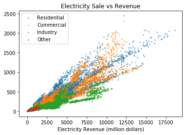

# Predicting US Monthly Electricity Consumption by State [repository](https://github.com/worasom/energy_sale_rev/)

Estimating electricity consumption is an important part of energy planning. The US Energy Information Administration (EIA) provides some estimations in their short-term energy outlook, [STEO](https://www.eia.gov/outlooks/steo/data/browser/). However, the report only provides regional electricity consumption and does not break the prediction down in a state-by-state basis. The goal of this project is to forecast monthly electricity consumption by state in three sectors: residential, commercial and industrial. These three sectors account for about 98.5% of total electrical consumption, as shown below. 

The consumption for each sector is predicted using a different machine learning model. The models use the number of electricity customer accounts, electricity prices, and economic data such as population by state, gross domestic product by state (GSP), and weather data, i.e. monthly heating and cooling days. The ability to predict electricity consumption, and the major contributing factors, not only helps with infrastructure planning and economical projections, but also estimates of electricity sales revenue and the deployment of more energy efficient products.  

The figure below shows monthly electricity consumption in each sector in California (Residential, Commercial, and Industrial), and the combined total in the last row. Seasonal patterns can be seen in all sectors. This means that the model features must included features with similar seasonal patterns.

After gathering all the data, I worked on cleaning up the data, checking for consistency and looking for errors. The same data is often reported in more than one place, but in different units (mega, million or billion). Through this, I discovered a mistake on the EIA website. The unit on the short-term energy outlook (STEO) website is given as billion kilowatthours, but should be million kilowatt hours. The total monthly consumption for the US is around 300,000 million kWh, not 300,000 **billion** kWh as reported by STEO.   

For the economics data, some data is not report monthly, and I filled in the missing data using forward fill (for the next phase of the project I will use linear interpolation). The electricity consumption data covers Jan, 1990 to Feb, 2019. There are 50 states + DC, but because the weather data for Alaska and Hawaii are missing, I omit them from the analysis. The GSP data ends on September 2018. After removing the missing data, I end up with approximately 17000 rows of data, approximately 13 MB in size. Data from 2015 onward is allocated as the test set. The picture below shows the hiearachial relationship between all features. 

I built three machine learning models, one for each of the three sectors. For each sector, random forest regressor was employed for feature selections and hyperparameter tuning. The datasets were split into train, validation and test sets by order of occurrence, then feature selection was made using feature of importance. Then, a better model and parameters were found using TPOT library (AutoML). The models were retrained again using the train + validation set. The models acehieved 0.98 - 0.99 r-square for each sector, translating to approximately 0.99 overall R-squared for the total consumption. STEO predictions have 0.9999 R-square (almost exact). The time-series prediction are compared with the actual consumption and short-term energy outlook report from EIA website. The prediction is deployed on heroku at https://worasom-energy.herokuapp.com/app. In this application, a user can observe time-series prediction for the state and sector that they are interested in. The picture below shows a screen shot of the app.

In the next phase of the project, I will perform predictions for 2020 consumption. I will include a confidence interval for my projections. This is achieved by first projecting all features required by the models with a linear autoregressive model. For the web application, I will also improve the aesthetics of the application and include a statistical summary. In terms of model performance, I have identified some states that the models have difficulty predicting the electricity consumptions for, as shown below. I will try to improve the model performance for these states, which might be achieved by creating separates model for these states. Lastly, I plan to automate the anaylsis pipeline: data acqusition, formatting, machine learning and deploying the prediction.

Detail analysis procedure can be found below.

## Table of Contents

1. [Data Sources](#sources): links to all data sources
2. [Analysis Procedure](#procedure)
3. [Data Clean Up](#cleanup) and Exploratory Data Analysis
4. [Features Relationship](#epa)
5. [Machine Learning Models](#ml)
6. [Models Performance](#performance)
7. [Model Deployment on Heroku](#app)[Repository](https://github.com/worasom/energy_app)
8. [Summary and Future Work](#sum)

## Data Sources

The data comes from the following sources:

- Monthly energy consumption, revenue, prices, and number of customer by sector by state since 1990 from https://www.eia.gov/electricity/data.php#sales, https://www.eia.gov/electricity/data/browser/, and https://www.eia.gov/electricity/sales_revenue_price/. The sectors are residential, commercial, transportation, and other. There are 50 states + 1 for DC. 
- Monthly short-term estimated eletricity consumption from short-term energy outlook (STEO), https://www.eia.gov/outlooks/steo/data/browser/.
- Population by state from https://fred.stlouisfed.org, example, https://fred.stlouisfed.org/series/ALPOP
- Monthly number of heating and cooling days by state from National Centers for Environmental Information, https://www.ncdc.noaa.gov/ushcn/data-access. There is no data from Alaska and Hawaii. 
- Monthly unemployment rate by state from Federal Reserve Bank of St. Louis, https://fred.stlouisfed.org. example , https://fred.stlouisfed.org/series/CAUR
- Quarterly total personal income by state https://fred.stlouisfed.org, example, https://fred.stlouisfed.org/series/ALOTOT
- Monthly consumer price index by state excluding food and electricity from https://fred.stlouisfed.org/series/CPILFENS
- GSP  by state  from U.S. Bureau of Economic Analysis (BEA), https://apps.bea.gov/regional/downloadzip.cfm and https://fred.stlouisfed.org 

## Analysis Procedure 

- Obtained data by downloading and using web API [notebook](https://github.com/worasom/energy_sale_rev/blob/master/api.ipynb) (selenium library).
- Performed extensive feature engineering, cross checking the accuracy and consistency of the data. Cleaned up missing data [notebook](https://github.com/worasom/energy_sale_rev/blob/master/clean_energy_data.ipynb). The cleaned data has approximately 17000 rows, is about 13 MB in size, and can be found at [folder](https://github.com/worasom/energy_sale_rev/tree/master/clean-data). 
- Completed exploratory data analysis [notebook](https://github.com/worasom/energy_sale_rev/blob/master/EPA_energy_data.ipynb) (pandas, numpy, seaborn). Visualize hierarchical relationship between features (scipy library) 
- Performed feature selection and built machine learning models for the three sectors,  analyzed model performance by state [notebook](https://github.com/worasom/energy_sale_rev/blob/master/energy-ML.ipynb) (scikit-learn, TPOT libaries). Use random forest regressor and feature of importance for feature selection. Achieve 0.99 R-squared for the test set (EIA's prediction is 0.9999). Build a prediction pipeline and visualization from saved models (joblib library). Plotted interactive time-series prediction in Bokeh.
- Deployed model prediction [Repository](https://github.com/worasom/energy_app)

## Data Clean Up [notebook](clean_energy_data.ipynb) and Explore Data [notebook](EPA_energy_data.ipynb)

After gathering all the data, I worked on cleaning up the data, checking for consistency and looking for errors. The same data is often reported in more than one place, but in different units (mega, million or billion).

**Electricity Data**:Obtained sales, revenue, number of account and prices from three sections of EIA website. The file sale_revenue_by_state.csv from [link](https://www.eia.gov/electricity/data.php#sales,) contains sales, revenues, prices and number of accounts all the way back to 1990, but lacks recent data from 2019. This data is merged with other sets of data from the EIA's interactive website [link](https://www.eia.gov/electricity/data/browser/), and [link](https://www.eia.gov/electricity/sales_revenue_price/).

For sales, revenue, prices and number of customer accounts I did the following:

- Inspected the two sets of data and checked for consistency
- Converted the data sets to the same unit
- Modified the table structure so that 'Year', 'Month', 'State' and each sector had its own columns. However, the Transportation sector only has recent data, so I combined it with the 'Other' sector into a single column.
- Merged data
- Exported files as .csv

Explored the relationship between electricity sales and revenue. Revenue has a linear relationship with consumption, with the slope being the retail price. Being able to predict the consumption enables us to predict the revenue.

 

The three major sectors: residential, industrial and commercial accounts for 98.5% of the total consumption. 'Transportation' and 'Other' account for the remaining 1.5%. 

Since all models consider state population as the most important feature, it is worth looking at the consumption per population for each state.

 

This plot shows the average electricity consumption per capita by state in 2018, segmented into residential, industrial, and commercial consumption. Within each plot, the states are first grouped by regions, then sorted by the latitude of the state. For residential consumption, one might expect that electricity consumption would be higher in the northern states, because of the necessity of heating during their long, severe winters; however, the southern states actually top the electricity consumption charts.  This suggests that the number of days that require air conditioning usage (number of cooling days) and regional information are likely important features in the model. For the industrial sector, the consumption also has a strong regional trend, again suggesting that regional information is an important feature for this sector. For the commercial sector, except for DC, the consumption is pretty uniform, thus the regional information is likely not important. 

**STEO data** EIA reports estimation of future electricity consumption in short-term energy outlook (STEO) in https://www.eia.gov/outlooks/steo/data/browser/. The data went back to 2015. I discovered a mistake on the EIA website. The unit on the short-term energy outlook (STEO) website is given as billion kilowatthours, but should be million kilowatt hours. The total monthly consumption for the US is around 300,000 million kWh, not 300,000 **billion** kWh as reported by STEO.  

**Heating and Cooling days by State**: Heating and cooling degree day measure the dmain for energy to heat and cool the building. This is calculated and reported in the monthly weather data in ftp://ftp.ncdc.noaa.gov/pub/data/cirs/climdiv/. Each row corresponds to a year of monthly data for that state. The columns are stored in state code, and thus need to be reformatted. The data for Alaska and Hawaii is missing. 

The figure below shows heating and cooling degree days in January and July for some states.
The data are pretty noisy and will be the major source of the model error. For the cooling degree days the slope is positive for most states, but each state has different slope. For heating degree days, both positive and negative slopes were observed. Estimating the future heating and cooling degree days would required a separated model for each state. 

 

**GDP per state (GSP)**:There are annual GSP by state from https://apps.bea.gov/regional/downloadzip.cfm, and quarterly GSP by state from https://fred.stlouisfed.org. The data is merged and forward fill is used to obtain monthly data.

**Population Data**:We want to get monthly population data for each state, which does not exist. Fortunately, the St. Louis Frederal Economic Data provides some estimations based on the Census data. From projections of the US population each month, we can estimate the population for each state on a monthly basis using the annual state population data. 

 **Personal Income by State**:St. Louis Frederal provides a quarterly total personal income by state, for example https://fred.stlouisfed.org/series/ALOTOT. The income is projected by forward fill to obtain monthly data.

**Consumer Price Index US**:St. Louis Frederal summarizes a monthly consumer price index excluding food and electricity in https://fred.stlouisfed.org/series/CPILFENS. The same number is used for all states. 

Although the economical indicator such as Population, Personal Income, and GSP do not grow linearly with time, a short-term growth is linear as shown below. This mean shorterm future values can be estimated using linear auto-regressive model. This will be usedful for predicting future energy consumption.

 

**Unempolyment by State**:St. Louis Frederal provides a monthly unempolyment by state, for example https://fred.stlouisfed.org/series/CAUR. After downloading the data for each state using the API, the data is reformatted.

**Regional group**: EIA groups the states into sub regions. This group may be usedful as a feature and visualization. The regional group is extracted for the descrption column in EIA data. EIA's regional group are shown below.

## Data Relationship [notebook](EPA_energy_data.ipynb)

The electricity consumption data covers Jan, 1990 to Feb, 2019. There are 50 states + DC, but because the weather data for Alaska and Hawaii are missing, I omit them from the analysis. The GSP data ends on September 2018. After removing the missing data, I end up with approximately 17000 rows of data, approximately 13 MB in size. Data from 2015 onward is allocated as the test set. The dedogram below shows relationship among the fetures based on spearman correlation. 

Population and number of customer are related. The GSP, income and Sale revenue are closely related. The number of heating and day is related to the location of the state. The revenue columns will not be fed into the model because of the direct relationship with the sale. Consider dropping one of the close relationship feature pairs: year and CPI, population and number of customer.

## Machine Learning Models 

I built a Machine learning model for each sector using the following procedure:

1. Split the data into train, validation and test sets
2. Use random forest regression to select features by feature of importance
3. Try dropping feature pairs with high correlation such as number of customer and population, income and GSP
4. Use TPOT to find the best model
5. Train the model on the training + validation set and predict using the test set
6. Analyze model performance by state

**Splitting the data** We have the data from Jan 1990 to Sept 2018. The time-series data cannot be split by random shuffle, and have to be split by order of occurrence, for hyper parameter tuning and model searching in TPOT. The data is split into train (64%), validation (20%) and test (15%) sets using the function `three_split`. The model is retrained using the train + validation set using the function `two_split`. The test set is used to evaluate the model performance. The figure belows show the splitting for hyperparamter tuning and for the final model.

Use random forest regressor to predict the electricity sales for each sector. After hyperparameter tuning, the model achieved 0.95 - 0.97 R-squared on the test set (15% of the data). 

The figure below shows the features selected by the model for the residential, industrial and commercial sectors.

The selected features were feed into TPOT (AutoML) for model selection and hyperparameter tuning. After training with the training + validation set, the model for each section achieved 0.98 - 0.99 R-square. The predictions for the three sectors are summed together, and the R-squared score is calculated against the actual data. The overall R-squared is 0.99. The picture below summarizes the model performance for each sector.

## Model Performance  

I analyzed the machine learning model performance by state. The picture below shows R-square for each sector and state. Although the model obtain 0.99 R-square, the model performed poorly on some states.  

For the residential sector, the model performed poorly for WI, NH and CO, which are northern states with low population density.  For the industrial sector, the model did poorly on DC. For the commercial sector, VT, NH, WI are the worst. Overall, the model had poor predictions for the consumption in VT, NH, and WI.

The figure below coompares the time-series prediction and the actual data for the three best and the three worst predictions. The predictions capture the seasonal patterns observed in the data, but over estimates the consumption in VT, NH and WI.

STEO predictions have 0.9999 R-square (almost exact).

Plotting the model performance on the map, we see that the model performs well on the southern states, which have high population and high consumption (blue). But the model performs poorly for the sparsely populated northern and mountain regions states (red). I may need to have a separate ML for these states in order to improve the prediction accuracy. 

##  Model Deployment on Heroku  

Monthly prediction, actual data and STEO from 2015 onwards are saved as a .csv file. In this application, users can observe the actual and predicted electricity consumption for a state and a sector. The application also shows the corresponding STEO prediction for that region. [Repository](https://github.com/worasom/energy_app). You can experiment with the application by through this [link](https://worasom-energy.herokuapp.com/app). The picture below shows a screen shot of the app.

## Summary and Future Work 

In summary, this project aims to predict monthly electricity consumption for each state in the US using population, weather, and economic data. Separate machine learning models were constructed for each of the three main electricity consumption sectors (residential, industrial, and commercial). The models acehieved 0.98 - 0.99 r-square for each sector, which translates to approximately 0.99 overall R-squared for the total consumption. The US EIA STEO prediction has 0.9999 R-square (almost exact). The time-series predictions are compared with the actual consumption and short-term energy outlook report from the EIA website. The prediction is deployed on heroku at https://worasom-energy.herokuapp.com/app.

In the next phase of the project, I will perform predictions for 2020 consumption. I will include a confidence interval for my projections. This is achieved by first projecting all features required by the models with a linear autoregressive model. For the web application, I will also improve the aesthetics of the application and include a statistical summary. In terms of model performance, I have identified some states that the models have difficulty predicting the electricity consumptions for, as shown below. I will try to improve the model performance for these states, which might be achieved by creating separates model for these states. Lastly, I plan to automate the analysis pipeline: data acqusition, formatting, machine learning and deploying the prediction.