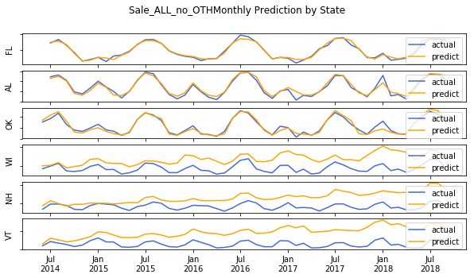
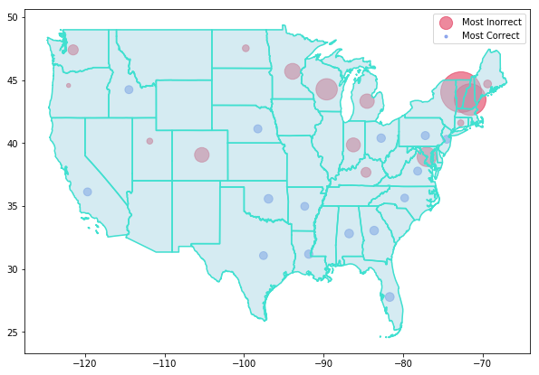

# Predicting US Monthly Electricity Consumption by State [repository](https://github.com/worasom/energy_sale_rev/)

Estimating the electricity consumption is an important part of energy planning. The US’s Energy Information Administration (EIA) provides some estimations in their short-term energy outlook, [STEO](https://www.eia.gov/outlooks/steo/data/browser/). However, the report only provide regional electricity consumption and does not provide state-wise estimation. The goal of this project is to forecast monthly electricity consumption by state in three sectors: residential, commercial and industrial. These three sectors account for about 98.5% of total electrical consumption as shown below. 

The consumption for each sector is predicted using a different machine learning model. The models use the number of electricity customer accounts, electricity prices, and economic data such as population by state, gross domestic product by state (GSP), and weather data. i.e. monthly heating and cooling days. The ability to predict the electricity consumption, and the major contributing factors would not only help with infrastructure planning, economical projection, coming energy efficient products but also estimation of electricity sales revenue.  

The picture below shows monthly electricity consumption in each sector in California. Seasonal pattern is seen for all sectors. This means that the features must included features with similar seasonal patterns.

After gathering all the data, I worked on cleaning up the data. Sometimes the same data are reported in two places. I checked the consistency of the data and the units. Checking the units are important because the same number are often reported in more than one places, but in different units (mega, million or billion). I  found some mistake on the EIA website. The unit in STEO website is billion kilowatthours, but should be  million kilowatt hours. The total monthly consumption for the US is around 300,000 million kWh. STEO said the consumption is 300,000 **billion** kWh If the unit is really billion kWh, then the STEO projection is off by 1000 times. 

For the economics data, some data are not report monthly, thus I have to filling the missing data by forward fill (for the next phase of the project I will use linear interpolation). The electricity consumption data starts on Jan, 1990 to  Feb, 2019. There are 50 states + DC, but the data for weather data for Alaska and Hawaii are missing, thus omitted in this analysis.The GSP data end on September 2018. After removing the missing data, I end up with approximately 17000 rows, is about 13 MB in size. Data set from 2015 on ward is allocated as the test set. The picture below shows hiearachial relationship between all features. 

I built three machine learning models for the three sectors. For each sector, random forest regressor was employed for feature selections and hyperparameter tuning. The datasets were split datasets into train, validation and test set by order of occurrence, then feature selections was made using feature of importance. Then, a better model and parameters were search using TPOT library (AutoML). The model were retrained again using train+validation set. The models acehieve 0.98 - 0.99 r-square for each sector, which transfer to about 0.99 overall R-squared for the total consumption. STEO prediction has 0.9999 R-square (almost exact). The time-series prediction are compared with the actual consumption and short-term energy outlook report from EIA website. The prediction is deployed on heroku at https://worasom-energy.herokuapp.com/app. In this application, a user can observe time-series prediction for the sector, and state they are interested in. The picture below shows screen shot of the app.

In the next phase of the project, I plan to perform prediction for 2020 consumption. I plan to include confidence interval in the projection. This is achieve by first projecting all features required  by the models with linear autoregressive model. For the application, I will also improve the aesthetic for the applications, and include import informations. In term of model performance, I did some analysis and identify some states that the models have difficulty prediction their electricity consumptions as shown below. I will also try to improve the model performance for in these states, which might be achieved by creating separates model for these states. 

## Table of Contents

1. [Data Sources](#sources): links to all data sources
2. [Analysis Procedure](#procedure)
3. [Data Clean Up](#cleanup) and Exploratory Data Analysis
4. [Features Relationship](#epa)
5. [Machine Learning Models](#ml)
6. [Models Performance](#performance)
7. [Model Deployment on Heroku](#app)[Repository](https://github.com/worasom/energy_app)
8. [Summary and Future Work](#sum)

## Data Sources

The data are from the following sources:

- Monthly energy consumption, revenue, prices, and number of customer by sector by state since 1990 from https://www.eia.gov/electricity/data.php#sales, https://www.eia.gov/electricity/data/browser/, and https://www.eia.gov/electricity/sales_revenue_price/. The sectors are residential, commercial, transportation, and other. There are 50 states + 1 for DC.  
- Population by state from https://fred.stlouisfed.org, example, https://fred.stlouisfed.org/series/ALPOP
- Monthly number of heating and cooling days by state from National Centers for Environmental Information, https://www.ncdc.noaa.gov/ushcn/data-access. There are no data from Alaska. 
- Monthly unemployment rate by state from Federal Reserve Bank of St. Louis, https://fred.stlouisfed.org. example , https://fred.stlouisfed.org/series/CAUR
- Quarterly total personal income by state https://fred.stlouisfed.org, example, https://fred.stlouisfed.org/series/ALOTOT
- Monthly consumer price index by state excluding food and electricity from https://fred.stlouisfed.org/series/CPILFENS
- GSP  by state  from U.S. Bureau of Economic Analysis (BEA), https://apps.bea.gov/regional/downloadzip.cfm and https://fred.stlouisfed.org 

## Analysis Procedure 

- Obtain data by downloading and using web API [notebook](api.ipynb)
- Extensive feature engineering, cross checking the accuracy and consistency of the data. Clean up the missing data [notebook](clean_energy_data.ipynb). The cleaned data has approximately 17000 rows, is about 13 MB in size, and can be found in [folder](https://github.com/worasom/energy_sale_rev/tree/master/clean-data). 
- Exploratory data analysis [notebook](EPA_energy_data.ipynb)
- Feature selection and built machine learning models for the three sectors,  analyse model performance by state [notebook](energy-ML.ipynb). Plot time-series prediction.
- Model prediction deployment [Repository](https://github.com/worasom/energy_app)

## Data Clean Up [notebook](clean_energy_data.ipynb) and Explore Data [notebook](EPA_energy_data.ipynb)

**Electricity Data**:Obtained sales, revenue, number of account and prices from three sections of EIA website. The file sale_revenue_by_state.csv from [link](https://www.eia.gov/electricity/data.php#sales,) contains sales, revenues, prices and number of accounts all the way back to 1990, but lack recent data in 2019. This data is merged with another sets are from the EIA's interactive web [link](https://www.eia.gov/electricity/data/browser/), and [link](https://www.eia.gov/electricity/sales_revenue_price/).

For sales, revenue, prices and number of customer accounts I did the following procedures

- Inspect of two sets of data and check for consistency
- Convert unit
- Change the table structure with 'Year', 'Month', 'State' columns and each sectors as it own columns. However, the Transportation sector has only be recored recently, so I combined them with other columns.
- Merge data.
- Export files as .csv

Explore relationship between the electricity sale and revenue. Since revenue follow a linear relationship with consumption with slope as retail price. Being able to predict the consumption also means predicting the revenue.

 

The tree major sectors: residential, industrial and commercial accounts for 98.5% of the total consumption. The rest 1.5% are transportation and other sector. 

Since all models consider state population as the most important feature, it is worth looking at the consumption per population for each state.

 

This plot shows average electricity consumption per capita by state in 2018, segmented into the consumption for the residential, industrial, and commercial sectors. Within each plot, the states are first grouped by regions, then sorted by the latitude of the state. For residential consumption, one might expect that electricity consumption would be higher in the northern states, because of the necessity of heating during their long, severe winters; however, the southern states actually top the electricity consumption charts.  This suggests that the number of days that requires air conditioning usage (number of cooling days) and regional information are likely important features in the model. For the industrial sector, the consumption also has a strong regional trend, against suggesting that regional information is an important feature for this sector. For the commercial sector, except for DC, the consumption is pretty uniform, thus the regional information is likely not important. 

**Population Data**:We want to get a monthly the population data for each state, which does not exist. Fortunately, St. Louis Frederal Economic Data provide some estimation based on the Census data. From projection of US monthly population, use annual population by state to calculate the monthly population by state. 

**Heating and Cooling days by State**:Monthly weather data from ftp://ftp.ncdc.noaa.gov/pub/data/cirs/climdiv/. Each row corresponds to a year of monthly data for that state. The columned are stored in state code, thus need to be reformated. The data for Alaska is missing. 

**Unempolyment by State**:St. Louis Frederal provides a monthly unempolyment by state for example https://fred.stlouisfed.org/series/CAUR. After downloading the data for each state using the API, the data are reformated.
 
**Personal Income by State**:St. Louis Frederal provides a quarterly total personal income by state example, https://fred.stlouisfed.org/series/ALOTOT. The income is project by forward fill to obtain a monthly data.

**Consumer Price Index US**:St. Louis Frederal summarizes a monthly consumer price index excluding food and electricity in https://fred.stlouisfed.org/series/CPILFENS. The same numer is used for all states. 

**GDP per state (GSP)**:There are annual GSP by state from https://apps.bea.gov/regional/downloadzip.cfm, and quarterly GSP by state from https://fred.stlouisfed.org. The data are put together and forward fill to obtain a monthly data.

**Regional group**: EIA group the states into sub regions. This group could be usedful as a feature and visualization. The regional group is extracted for the descrption column in EIA data. 

## Data Relationship [notebook](EPA_energy_data.ipynb)

The dedogram below shows relationship among the fetures based on spearman correlation. 

Population and number of customer are related. The GSP, income and Sale revenue are closely related. The number of heating and day is related to the location of the state. The revenue columns will not be fed into the model because of the direct relationship with the sale. Consider dropping one of the close relationship feature pairs: year and CPI, population and number of customer.

## Machine Learning Models 

Build a Machine learning model for each sector using the following procedure:

1. Split the data into train, validation and test set
2. Use random forest regression to select feature by feature of important
3. Try dropping feature pairs with high correlation such as number of customer and population, income and GSP
4. Use TPOT to find the best model
5. Train the model on the training+validation set and predict on the test set
6. Analys model performance by state

**Splitting the data** We have the data from Jan 1990 to Sept 2018. The time-series data cannot be split by random shuffle, and have to be split by order of occurance. For hyper parameter tuning and model searching in TPOT. The data were split into train (64%), validation(20%) and test(15%) sets using the function `three_split`. The model is retrained using the train+validation set using the function `two_split`. The test set is used to evaluate the model performance. The fiture belows show the splitting for hyperparamter tuning and for final model.

Use random forest regressor to predict the electricity sale for each sector. After hyperparameter tuning, the model achieve 0.95 - 0.97 R-squared on the test set (15% of the data). 

The figure below shows features selected by the model for residential, industrial and commercial sectors.

The selected features were feed into TPOT for model selection and hyperparameter tuning. After training with the training+validation set, the model for each section achieve 0.98 - 0.99 R-square. The predictions for the three sectors are summed together, and the R-squared score is calculated against the actual data. The overall R-squared is 0.99. The picture below summarizes model performance for each sector.

## Model Performance  

I analyze the machine learning model performance by state. The picture below shows R-square for each sector and state. Although the model obtain 0.99 R-square, the model poorly perform on some states.  

For the residential sector, the model perform poorly in WI, NH and CO, which are northern state and low population density.  For the industrial sector, the model did poorly on DC. For the commercial sector, VT, NH, WI are the worst. Overall, the model did poorly in predicting consumption in VT, NH, WI.

The figure below coompares the time-series prediction and the actual data for the three best and the worst prediction. The prediction capture seasonal pattern of the data, but over estimate the consumption in VI, NH and WI.

Plotting the model performance on the map, we see that the model performs well on the southern states, which have high population and high consumption (blue). But the model prediction of the electricity consumption of the sparsely populated northern and mountain regions states is poor (red). Improving prediction in these states may involve having separate ML for these states. 

##  Model Deployment on Heroku  

Monthly prediction, actual data and STEO from 2015 onwards are saved as .csv file. In this application, user can observe the actual and predicted electricity consumption for a state and a sector. The application also shows the corresponding STEO prediction for that region. [Repository](https://github.com/worasom/energy_app). You can play with the application by follow this [link](https://worasom-energy.herokuapp.com/app).

## Summary and Future Work 

In summary, this project aims to predict monthly electricity consumption for each state in the US using population, weather, and economic data. Separate machine learning models are constructed for each of the three electricity consumption sectors (residential, industrial, and commercial).The models acehieve 0.98 - 0.99 r-square for each sector, which transfer to about 0.99 overall R-squared for the total consumption. STEO prediction has 0.9999 R-square (almost exact). The time-series prediction are compared with the actual consumption and short-term energy outlook report from EIA website. The prediction is deployed on heroku at https://worasom-energy.herokuapp.com/app.

In the next phase of the project, I plan to perform prediction for 2020 consumption. I plan to include confidence interval in the projection. This is achieve by first projecting all features required  by the models with linear autoregressive model. For the application, I will also improve the aesthetic for the applications, and include import informations. In term of model performance, I did some analysis and identify some states that the models have difficulty prediction their electricity consumptions as shown below. I will also try to improve the model performance for in these states, which might be achieved by creating separates model for these states. 